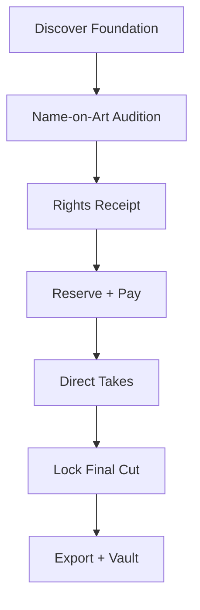
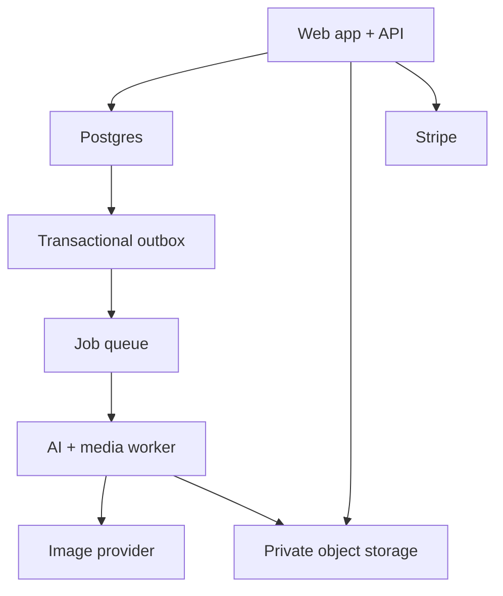

# SERGEY / EDITIONS
## Business, SaaS, and Website Framework

**Version:** 1.0  
**Assumption:** The visual identity and interface design already exist. This document defines the commercial, product, operational, legal, data, and technical system beneath them.  
**Launch model:** Single-artist, commerce-led SaaS.  
**Important:** This is a product and operating framework, not legal or tax advice. U.S. and international counsel should draft the final license instruments, terms, privacy policy, AI disclosures, refund policy, and exclusive-license process.

---

## 1. The business in one sentence

**SERGEY / EDITIONS licenses scarce, artist-led cover-art foundations, lets musicians direct controlled AI-assisted descendants inside a professional Studio, and registers one release-ready Final Cut with a precise rights and provenance record.**

This is not:

- a generic text-to-image generator;
- an unlimited template subscription;
- a bargain premade-cover shop;
- an open artist marketplace;
- a claim that every AI output is copyrightable or globally unique;
- a transfer of Sergey's Source Master copyright by default.

The product is the combination of:

1. **Sergey's authored catalog and taste**
2. **Limited access to each Source Master**
3. **Controlled customization rather than blank-canvas generation**
4. **A precise license for a named musical release**
5. **An exact Final Cut that the platform will not intentionally reissue**
6. **Release-ready exports, lineage, and a permanent Vault record**

AI is the workflow layer. The moat is the catalog, edit grammar, scarcity policy, final-file registry, trusted transaction, and accumulated history of what produces successful releases.

---

## 2. Governing product language

Use these terms consistently across marketing, product, database, support, and legal surfaces.

| Term | Meaning |
|---|---|
| **Source Master** | Sergey's immutable underlying artwork. Sergey retains its copyright unless a separate signed assignment says otherwise. |
| **Foundation** | The Source Master offered as the basis for licensed cover designs. |
| **Audition** | A watermarked, non-downloadable title/crop/context proof before purchase. |
| **Take** | One immutable AI-assisted candidate derived from a licensed Source Master. One Take equals one standalone image file. |
| **Final Cut** | The selected raster art plus deterministic typography/layout, locked for the named release. |
| **Edition** | One available licensed Final Cut slot associated with a Source Master. |
| **Release** | The named single, EP, album, or project identified in the license. |
| **Rights Receipt** | The plain-language, immutable pre-checkout summary of the exact commercial promise. |
| **License Grant** | The binding post-payment agreement snapshot for the buyer, release, artwork, edition, and usage scope. |
| **Edition Seal** | The registry record, certificate, and checksum created after Final Lock. It is not baked into the artwork. |
| **Vault** | The customer's permanent home for licenses, Final Cuts, exports, receipts, and lineage. |

Do not lead with “lease.” A release usually remains on DSPs for years; a perpetual license restricted to one named release is clearer than forcing a takedown after six months.

---

## 3. Positioning and customer

### 3.1 Primary customer

Independent recording artists, managers, producers, and boutique labels that:

- release several projects per year;
- already pay for production, mixing, mastering, video, promotion, and visual identity;
- want something more distinctive than a template or mass AI image;
- cannot justify a full commissioned campaign for every release;
- care about speed but do not want speed to look cheap;
- need rights that a manager, distributor, or label can understand.

### 3.2 Secondary customer

- Creative directors serving multiple artists
- Producers and mixing/mastering engineers bundling release services
- Small labels requiring approvals and reusable brand systems
- Established artists wanting a higher-priced exclusive or bespoke commission

### 3.3 Deliberately excluded at launch

- Bargain shoppers seeking a $20 cover
- Prompt-only hobbyists with no release intent
- Customers wanting unlimited unrelated generation
- Sellers uploading third-party art
- Open marketplace creators
- Buyers demanding copyright assignment through ordinary checkout

### 3.4 Jobs to be done

The customer is hiring the product to:

1. Discover art that already feels like the record.
2. See their real artist and release name on it immediately.
3. Understand scarcity, price, and rights without calling a lawyer.
4. Direct a few controlled changes without destroying the original's character.
5. Produce exact typography and DSP-ready files.
6. Show a label, manager, or client a traceable final.
7. Return for the next release without rebuilding a creative workflow from zero.

---

## 4. Business model

### 4.1 Commercial model

Launch as **commerce-led SaaS**, not subscription-first.

Revenue order:

1. Artwork licenses
2. Credit packs for probabilistic AI operations
3. Campaign upgrades and additional-release extensions
4. Artist's Eye Review and bespoke human services
5. Recurring Studio/Label plans only after repeat demand is proven
6. Invited-artist platform revenue only after the single-artist model works

Early target revenue mix:

- 70–85% licenses
- 10–20% credit packs
- 5–15% human review, campaign upgrades, or commissions

Mature target mix:

- 45–60% licenses
- 20–30% Studio/Label recurring revenue
- 10–20% credits
- limited high-margin services

### 4.2 Separate scarcity from usage scope

Do not combine every commercial variable into confusing license names. Model two independent dimensions.

#### Foundation class: how scarce is the Source Master?

| Class | Maximum Final Cut slots | Positioning |
|---|---:|---|
| **Archive** | Up to 5 | Accessible premium foundation |
| **Signature** | Up to 3 | Tighter scarcity and stronger art direction allowance |
| **Flagship** | 1, only while never previously licensed | Potential music-field exclusive or bespoke negotiation |

#### Usage scope: what may the buyer do?

| Scope | Intended use |
|---|---|
| **Limited Release License** | One named single, EP, album, or release; DSP artwork, organic social, press/editorial, ordinary distributor use |
| **Campaign License** | The named release plus defined paid advertising, physical packaging, campaign crops, music-video thumbnails, and specified merchandise or promotional use |
| **Music-Field Exclusive License** | Source Master retired from future music-cover licensing; available only if no prior music license exists; signed manual instrument required |
| **Copyright Assignment** | Rare, custom, separately priced legal transaction; never an ordinary ecommerce option |

The customer interface should present three or fewer relevant offers for each artwork, not a combinatorial pricing calculator.

### 4.3 Launch price hypotheses

These are controlled tests, not permanent truths.

| Offer | Initial range | Included value |
|---|---:|---|
| Free Audition | $0 | Watermarked name/title, crop, safe-area, thumbnail, sleeve, phone, and poster proofs |
| Archive / Limited Release | $149–195 | One named release, one registered Final Cut, 12 direction credits, standard release export |
| Signature / Limited Release | $275–350 | One of up to three editions, 25–30 credits, priority processing, expanded direction allowance |
| Campaign | $550–750 | Broader campaign media, physical packaging/defined merch, additional crops and deliverables |
| Music-Field Exclusive | $1,500–5,000+ | Manually reviewed, source retired from future music licensing, signed instrument |
| Artist's Eye Review | $125–250 | Sergey reviews selected Takes and returns one concise direction/selection pass |
| Bespoke Commission | From $3,500 | New human-led concept and negotiated production scope |
| Copyright Assignment | Custom | Rare counsel-led transfer priced separately from production and license fees |

Mass premade-cover stores frequently compete below $100, so premium pricing cannot be justified by “a downloadable image.” It must visibly include authored art, scarcity, auditioning, controlled customization, exact typography, release assets, rights clarity, and lineage. Public anchors include [Cover Art Market](https://www.coverartmarket.com/about/faq), [PremadePixels](https://www.premadepixels.com/), [Krea](https://www.krea.ai/), and [FLORA](https://flora.ai/pricing); they are context, not direct product equivalents.

### 4.4 Credit system

Credits fund probabilistic compute, not deterministic editing.

Never charge credits for:

- typography;
- crop/reframe within existing pixels;
- preview/proofing;
- compare;
- undo/history navigation;
- downloading an already purchased eligible export.

Initial operation hypotheses:

| Action | Credits |
|---|---:|
| Create one standard Take | 3 |
| Precision masked edit | 1–2 |
| Extend composition | 2 |
| Premium high-detail Take | 4 |
| Motion proof, later phase | 12–20 |
| Failed, blocked, or undelivered job | 0; hold automatically released |

Initial pack hypotheses:

| Pack | Price |
|---|---:|
| 20 credits | $19 |
| 60 credits | $49 |
| 150 credits | $99 |

Rules:

- Show exact credit cost before every run.
- Grant 12 credits with the standard license; tune until roughly 80% of normal buyers can finish without a top-up.
- Purchased credits do not expire in Phase 1.
- Promotional credits may expire only with conspicuous disclosure.
- Subscription credits may have capped rollover when subscriptions launch.
- Credits are service units, not cash, withdrawable value, crypto, or Stripe customer balance.
- Maintain at least an 80% target compute gross margin after provider cost, moderation, validation, storage, retries, and support.
- Reprice operations when provider economics change; never silently change a quoted in-progress job.

### 4.5 Subscription strategy

Do not launch with a forced subscription. Music releases are episodic, and premature subscriptions create avoidable churn.

Add only after repeat behavior is visible:

#### Studio Pass — initial hypothesis: $39/month

- 50 monthly credits
- priority queue
- saved brand presets and release briefs
- early Drop access
- no artwork license included

#### Label Room — initial hypothesis: $149/month

- 250 pooled monthly credits
- up to five seats
- review and approval flow
- shared brand kits
- private projects and centralized billing
- licenses still purchased per release

Cancellation never revokes licenses, Final Cuts, receipts, or exports already purchased.

### 4.6 Unit economics

Use contribution economics rather than vanity GMV.

```text
Contribution Margin =
(Revenue
 - payment fees
 - AI/provider cost
 - storage/render/delivery cost
 - variable support labor
 - refund and chargeback reserve
 - affiliate/referral payout)
/ Revenue
```

Initial operating targets:

- Self-serve license contribution margin: ≥75%
- Credit-pack gross margin: ≥80%
- Human review/bespoke margin after labor: ≥60%
- Refund rate: <5%
- Chargeback rate: <0.75%
- Paid acquisition payback: preferably on first order
- Blended CAC: no more than approximately 25% of expected 12-month gross profit

Do not invent lifetime value before real 90-, 180-, and 365-day cohorts exist.

---

## 5. Catalog and inventory model

### 5.1 Launch inventory

Launch with **30–50 exceptional Source Masters**, not hundreds of inconsistent works.

Recommended opening mix:

- 20–30 Archive foundations, up to five editions each
- 10–15 Signature foundations, up to three editions each
- 3–5 Flagship foundations eligible for manual exclusive negotiation

Release 6–10 prepared foundations per month as curated Drops. Retire weak inventory rather than training customers to wait for discounts.

### 5.2 Every Source Master needs

- ownership and creation-source documentation;
- untouched source file and SHA-256 hash;
- normalized master and watermarked display proxies;
- title, story, medium, year, and searchable mood metadata;
- focal point and approved square crops;
- **Protected / Adaptable / Extendable** masks;
- allowed and prohibited AI operations;
- edition class and capacity;
- usage-scope eligibility;
- prior-license truth;
- manually approved display colors;
- 3000px, 300px, 96px, 48px, phone, sleeve, poster, and story proofs;
- sensitive-subject, person, brand, or trademark restrictions;
- exclusive-eligibility flag computed from rights and sales history.

### 5.3 Publishability gate

| Status | Meaning | What the site may say |
|---|---|---|
| **Green** | Sergey created and controls all material; documentation complete | “Verified human-authored” where evidence supports it; exclusive eligibility possible |
| **Amber / Hold** | AI, stock, public-domain, commissioned, or third-party component requires rights review | Not publishable until derivative, resale, sublicensing, and exclusivity rights are documented; after approval use “artist-led, rights-reviewed” with disclosure |
| **Red / Blocked** | Rights conflict, unclear ownership, prohibited source, or missing permission | Never publish or generate from it |

A numbered edition does not cure missing sublicensing or derivative rights.

---

## 6. Licensing and rights framework

### 6.1 Core legal truth

U.S. copyright requires human authorship, although protectable human contributions can exist in works containing AI-generated material. Do not promise copyright in raw AI output or imply that prompting alone guarantees authorship. See the U.S. Copyright Office's [AI initiative and copyrightability report](https://www.copyright.gov/ai/) and [copyright overview](https://www.copyright.gov/what-is-copyright/).

An exclusive copyright license is treated as a transfer of copyright ownership and generally requires a signed writing. A click-through receipt alone should not be the only instrument for the exclusive tier. See [Copyright Office Circular 12](https://www.copyright.gov/circs/circ12.pdf) and [17 U.S.C. Chapter 1](https://www.copyright.gov/title17/92chap1.html).

### 6.2 What every standard grant identifies

- Buyer legal name and account/workspace
- Musical artist
- Release title and type
- Source Master
- Foundation class and edition number
- Registered Final Cut checksum
- Territory
- Duration
- Permitted media
- Paid-ad, physical, merchandise, and campaign permissions
- Modification rights
- Prohibited uses
- Service-provider permissions for distributors/printers/platforms
- Transfer and sublicensing limits
- Existing-license disclosure
- AI-assisted workflow disclosure
- Agreement version and document hash
- Purchase, issue, and Final Lock timestamps

Recommended default: worldwide, perpetual use for one named release, non-transferable except ordinary service providers, with the Source Master copyright retained by Sergey.

### 6.3 Exact Final Cut promise

The platform may promise:

- it will not intentionally sell or reissue the exact registered Final Cut file;
- the Final Cut checksum is associated with one license and release;
- other customers cannot download that exact locked export through the platform.

The platform must not promise:

- global visual uniqueness;
- that no similar image exists or will ever exist;
- copyright ownership of an entirely machine-generated output;
- source exclusivity when other editions already exist;
- automatic trademark eligibility.

### 6.4 Exclusivity rule

A Music-Field Exclusive License is available only when:

1. No active or historical music license has been issued from that Source Master.
2. No live limited reservation exists.
3. Every component permits the exclusive rights being granted.
4. Sergey approves the buyer, release, scope, and price.
5. Counsel-approved electronic documents are signed.
6. Payment clears.

Ordinary checkout creates a **pending exclusive order**, not the exclusive license itself. The license becomes effective only after the signed instrument's conditions are satisfied.

If a limited edition has already sold, Sergey may retire the Source Master from future sales, but the product must disclose the existing grants and must not call the result retroactively exclusive.

### 6.5 Rights Receipt

Show before Stripe:

- what the buyer receives;
- what remains Sergey's;
- named release;
- edition number/capacity;
- allowed use;
- prohibited use;
- included credits and Final Cut count;
- refund/cancellation implications;
- current license-document version.

Freeze this receipt as an immutable order snapshot. Never let a later terms update silently change an earlier transaction.

### 6.6 Prohibited uses baseline

Subject to counsel and artwork-specific policy:

- resale of the artwork or Final Cut as standalone art;
- stock, template, NFT, or prompt-pack resale;
- AI model training or dataset contribution;
- use as a logo or trademark without an explicit separate grant;
- unrelated releases or brands;
- sublicensing except ordinary production/distribution service providers;
- unlawful, hateful, exploitative, defamatory, or deceptive use;
- removal or falsification of rights/provenance records.

### 6.7 Takedown and disputes

Maintain documented workflows for:

- copyright complaints and counter-notices;
- emergency artwork pause;
- generation/download freeze;
- customer evidence preservation;
- disputed edition investigation;
- refund or replacement decisions;
- license suspension/revocation under defined contractual conditions;
- no deletion of audit evidence during a dispute.

---

## 7. End-to-end customer experience



### 7.1 Discover

- Browse editorial Drops, Archive wall, or intent-based search.
- Focus an artwork at meaningful scale.
- See title, edition availability, starting price, prior-license truth, and edit boundary without hover.

### 7.2 Audition

Guests may:

- enter artist and release name;
- use deterministic typography;
- test crop and safe areas;
- preview 300px, 96px, 48px, phone, sleeve, poster, and vertical story contexts;
- save or share a watermarked proof.

Guests may not:

- download the clean Source Master;
- perform unrestricted AI generation;
- obtain a usable high-resolution derivative.

The activation event is **NAME_ON_ART_COMPLETED**.

### 7.3 Reserve and pay

- Customer chooses the offered license.
- Server creates a 15-minute scarcity reservation.
- Rights Receipt appears before checkout.
- Account/sign-in is required no later than reservation confirmation.
- Use direct reservation checkout rather than a conventional multi-item cart for scarce editions.
- The browser return page never fulfills the order by itself.

### 7.4 Fulfill

Only a verified, idempotently processed payment event may:

- mark the order paid;
- allocate the edition number;
- issue the License Grant;
- create the Studio project;
- grant included credits;
- update availability;
- place the license and receipt in the Vault.

### 7.5 Direct

The Studio asks for a **Director's Note**, then exposes a structured plan:

- Change
- Target
- Preserve
- Avoid
- Scope: Refine / Reinterpret / Depart if policy permits
- Number of Takes
- Exact credit cost

The customer confirms the plan before credits are held.

### 7.6 Release

- Customer selects a Take.
- Exact typography/layout stays separate from the generated raster.
- Preflight validates dimensions, color, safe areas, font rights, license, and output profile.
- Final Lock creates a checksum and Edition Seal.
- Export worker creates the permitted package.
- Vault stores the license, final, manifest, receipt, and regeneration access.

---

## 8. Website information architecture

### 8.1 Public website

| Route | Purpose | Conversion responsibility |
|---|---|---|
| `/` | Experiential threshold and latest Drop | Get the visitor into real artwork immediately |
| `/archive` | Complete discovery surface | Move from browsing to artwork focus |
| `/drops/:slug` | Curated editorial collection | Tell a coherent story and create launch urgency without fake countdowns |
| `/art/:slug` | Canonical Sleeve Room | Show art, story, edition, price, boundaries, proofs, and license together |
| `/art/:slug/audition` | Name-on-Art and proofing | Produce the first personal emotional payoff |
| `/licensing` | Plain-language rights | Remove anxiety before checkout |
| `/how-it-works` | Source Master → Take → Final Cut → Edition | Explain controlled AI without provider jargon |
| `/journal` | Drops, process, customer releases, rights education | Organic acquisition and brand authority |
| `/journal/:slug` | Article/case study | Search and social landing page |
| `/about` | Sergey, authorship, process, standards | Establish artist trust |
| `/support` | Help and contact | Reduce abandonment and support load |
| `/legal/terms` | Platform terms | Legal requirement |
| `/legal/license` | Current standard license | Legal transparency |
| `/legal/privacy` | Privacy/data practices | Trust and compliance |
| `/legal/refunds` | Refund policy | Set expectations |
| `/legal/acceptable-use` | AI and artwork use rules | Prevent abuse |

### 8.2 Transactional routes

```text
/checkout/:reservationId
/checkout/:reservationId/return
/order/:orderId/complete
```

The completion route remains pending until server-confirmed fulfillment.

### 8.3 Authenticated product

```text
/projects
/studio/:projectId
/studio/:projectId/v/:versionId
/studio/:projectId/release
/vault
/vault/licenses/:licenseId
/vault/releases/:releaseId
/credits
/billing
/settings/profile
/settings/workspace
/settings/security
```

### 8.4 Admin

```text
/admin
/admin/import
/admin/artworks
/admin/artworks/:id
/admin/rights
/admin/collections
/admin/drops
/admin/licenses
/admin/pricing
/admin/orders
/admin/reservations
/admin/customers
/admin/projects
/admin/ai-jobs
/admin/review
/admin/credits
/admin/refunds
/admin/exports
/admin/support
/admin/audit
/admin/analytics
/admin/policies
/admin/feature-flags
```

Public pages are cacheable and indexable. Studio, Vault, checkout, and admin are private and excluded from search indexing. Place admin on a separate host or security boundary when practical.

### 8.5 Website laws

- Artwork, price, edition, and license label are never hover-only.
- The home page performs discovery; it is not a generic marketing wrapper around “the app.”
- Every artwork has a canonical URL.
- Quick views may exist, but cannot replace canonical pages.
- The same artwork persists from Archive to Sleeve Room to Studio to Vault.
- No fake viewers, countdowns, reviews, scarcity, or sold-status theater.
- Legal and checkout surfaces are motionless and exact.
- Public previews are watermarked and resolution-limited.
- SEO uses actual artwork stories, Drop essays, case studies, and rights education—not AI-generated keyword filler.

---

## 9. SaaS product modules

### 9.1 Identity and workspaces

- Customer identity
- Future team-ready `workspace_id` on all customer records
- Roles: Owner, Editor, Viewer
- Admin roles separated by catalog, support/trust, finance, and super-admin powers
- Admin MFA mandatory

### 9.2 Catalog and curation

- Local master ingestion
- Asset hashing and deduplication
- Metadata and story
- Collections/Drops
- Boundary policies
- Edition series
- License eligibility and pricing
- Publish scheduling and pause/retire controls

### 9.3 Audition and proofing

- Exact typography
- Crop/reframe
- Responsive context proofs
- Watermarked sharing
- No anonymous pristine AI derivatives

### 9.4 Reservations and commerce

- Atomic scarcity reservation
- Rights Receipt snapshot
- Checkout session
- Webhook inbox and idempotent fulfillment
- Refund, chargeback, and reconciliation records

### 9.5 Projects and Studio

- Creative brief
- Director's Note parser
- Edit plan
- Mask/target controls
- Job quote and credit hold
- One-Take-per-file delivery
- Compare, select, branch, and immutable history
- Deterministic type/layout document

### 9.6 Finalization and Vault

- Final Lock
- Preflight
- Registered checksum
- Export profiles
- Rights Receipt
- License Grant
- Certificate and manifest
- Regenerable delivery package

### 9.7 Admin and operations

- Rights review
- Catalog ingestion
- Edition and pricing control
- Orders/refunds/disputes
- AI job timeline and provider spend
- Credit adjustments with reason codes
- Review queue
- Support cases
- Audit export and kill switches

---

## 10. Controlled AI framework

### 10.1 Phase 1 capabilities

Build one excellent controlled edit workflow before adding a model buffet.

Recommended operations:

- relight/recolor within the Source Master's Visual DNA;
- replace or remove an approved region;
- extend canvas into an approved edge;
- create title-negative-space in an adaptable region;
- refine texture/detail;
- deterministic crop, typography, and layout after generation.

Do not launch with:

- unlimited blank-canvas text-to-image;
- user-selected model/provider menus;
- arbitrary user source uploads;
- custom model training;
- public audio ingestion;
- full Photoshop-style brush tooling;
- motion covers.

### 10.2 Provider abstraction

The product owns stable operation names:

```text
RELIGHT
RECOLOR
REPLACE_REGION
REMOVE_REGION
EXTEND_CANVAS
CREATE_NEGATIVE_SPACE
REFINE_DETAIL
```

Provider adapter interface:

```text
planEdit()
estimateCost()
generate()
edit()
cancelIfSupported()
normalizeResult()
getCapabilities()
```

Use one primary image provider and one fallback. Provider/model identity belongs in provenance details, not the main customer workflow.

### 10.3 Job pipeline

1. Verify user, workspace, project, active license, and allowed operation.
2. Convert Director's Note into a strict structured Edit Plan.
3. Freeze source hash, mask, boundary-policy version, prompt-template version, provider/model, parameters, cost, and idempotency key.
4. Atomically create job, credit hold, and outbox event.
5. Moderate prompt and inputs.
6. Worker loads private source and masks.
7. Worker calls provider.
8. Validate decode, dimensions, content policy, protected regions, unwanted text, and single-image format.
9. Deterministically restore protected pixels outside approved masks or reject the result.
10. Normalize color profile, hash, and store the immutable result.
11. Create version node and manifest.
12. Capture credits only after a valid Take is delivered.

Image masks are guidance to generative models, not guaranteed pixel boundaries. Protected areas must be enforced with deterministic compositing and image-difference validation, not prompting alone. See the official [OpenAI image-generation guide](https://developers.openai.com/api/docs/guides/image-generation).

### 10.4 Retry and failure rules

- Safe failure before provider acceptance: retry automatically.
- Known transient provider failure: bounded retry.
- Unknown timeout after provider submission: reconcile using provider request ID before retrying.
- Invalid, blocked, or undelivered result: deliver nothing and release the hold.
- Duplicate client request: return the original job using idempotency key.
- Four requested Takes create four jobs and four files, not one contact sheet.

### 10.5 Version model

Backend: immutable directed acyclic graph.  
Customer UI: simple filmstrip.

Version kinds:

```text
SOURCE_MASTER
AI_TAKE
CROP_COMPOSITE
TYPE_COMPOSITE
FINAL_CUT
EXPORT_DERIVATIVE
```

Rules:

- Source Master is immutable.
- Editing always creates a child.
- Undo moves to an earlier node; it never deletes history.
- Locked Final Cuts remain recoverable.
- Editing a locked Final creates a new branch.
- Exact typography/layout is stored separately from raster art.

### 10.6 Export pipeline

At Final Lock:

1. Freeze selected raster and layer document.
2. Validate fonts and commercial font licenses.
3. Validate square composition and safe areas.
4. Render exact 3000×3000 sRGB PNG/JPEG.
5. Remove preview watermark.
6. Compute SHA-256.
7. Register checksum against License Grant and edition.
8. Generate certificate and manifest.
9. Produce only tier-permitted derivatives.
10. Package exports and rights documents separately.

Store platform delivery requirements as versioned `export_profiles`, not permanent hardcoded assumptions.

---

## 11. Commerce and credit architecture

### 11.1 Stripe boundary

Use Stripe-hosted or embedded Checkout Sessions for one-time licenses and credit packs. Use Stripe Billing plus Checkout only when recurring plans launch; do not implement manual renewal loops. Use the Customer Portal for self-service subscription changes. See Stripe's official [Checkout documentation](https://docs.stripe.com/payments/checkout), [subscription overview](https://docs.stripe.com/billing/subscriptions/overview), and [Customer Portal documentation](https://docs.stripe.com/customer-management/integrate-customer-portal).

Stripe owns dollar payment state. The application owns:

- reservations;
- edition inventory;
- License Grants;
- Rights Receipts;
- Studio credits;
- projects and Final Cuts.

### 11.2 Order flow

1. Create reservation in a database transaction.
2. Freeze price, rights, agreement, and inventory snapshot.
3. Create Stripe Checkout Session.
4. Customer pays.
5. Signed webhook enters an idempotent inbox.
6. Fulfillment transaction allocates edition and license.
7. Return page reads server state.

Never fulfill from the success URL alone. Verify signatures against the raw webhook body and process each provider event once. See [Stripe webhooks](https://docs.stripe.com/webhooks).

### 11.3 Credit ledger

Maintain an append-only application ledger, not a mutable balance column and not Stripe customer balance.

Entry types:

```text
PURCHASE_GRANT
LICENSE_INCLUDED_GRANT
SUBSCRIPTION_GRANT
PROMOTIONAL_GRANT
JOB_DEBIT
EXPIRATION
REFUND_REVERSAL
ADMIN_ADJUSTMENT
```

Hold states:

```text
ACTIVE → CAPTURED | RELEASED | EXPIRED
```

Rules:

- Available balance is derived from ledger entries minus active holds.
- Every mutation has an idempotency key.
- Lock the credit account or use serializable transactions for holds.
- Successful delivery captures; every other terminal state releases.
- Never double-spend credits across concurrent jobs.
- Manual adjustment requires a reason; large adjustments should require second approval.
- Track provider cost per consumed credit and outstanding credit liability.

### 11.4 Refund framework

Counsel must finalize jurisdiction-specific terms. Product behavior should distinguish:

- Provider/job failure: automatic full credit release.
- Duplicate payment or platform failure: corrective refund.
- Unused license before source access/generation/finalization: defined review window.
- After clean Final Cut/export delivery: no discretionary refund except defect, misrepresentation, or law-required remedy.
- Campaign/exclusive/bespoke work: milestone-specific terms.
- Chargeback: freeze new jobs and preserve all evidence; do not delete the customer's Vault records or audit history.

---

## 12. Core data model

### Identity

- `users`
- `workspaces`
- `workspace_memberships`
- `auth_identities`
- `sessions`
- `role_assignments`

### Catalog and rights

- `artworks`
- `artwork_assets`
- `artwork_boundary_policies`
- `rights_records`
- `collections`
- `collection_artworks`
- `drops`
- `license_products`
- `license_product_versions`
- `edition_series`
- `edition_allocations`

### Commerce

- `reservations`
- `reservation_items`
- `orders`
- `order_items`
- `payment_records`
- `refund_records`
- `payment_webhook_inbox`
- `rights_receipts`
- `license_grants`
- `registered_finals`
- `release_registrations`

### Studio

- `projects`
- `project_members`
- `creative_briefs`
- `edit_plans`
- `version_nodes`
- `version_edges`
- `masks`
- `layer_documents`
- `ai_job_groups`
- `ai_jobs`
- `provider_attempts`
- `moderation_checks`
- `quality_checks`
- `final_locks`
- `export_jobs`
- `export_assets`

### Credits

- `credit_accounts`
- `credit_ledger_entries`
- `credit_grants`
- `credit_holds`
- `credit_consumption_allocations`
- `credit_cost_policies`
- `credit_packages`
- `subscriptions`

### Governance

- `artifact_manifests`
- `audit_events`
- `outbox_events`
- `admin_review_cases`
- `support_cases`
- `takedown_cases`
- `feature_flags`
- `notification_deliveries`

Critical uniqueness constraints:

- payment provider + event ID
- workspace + idempotency key
- edition series + edition number
- provider + provider request ID
- asset SHA-256
- one active exclusive reservation/grant per eligible Source Master

---

## 13. State machines

### Artwork

```text
DRAFT → INGESTED → RIGHTS_REVIEW → READY → PUBLISHED
PUBLISHED → PAUSED | RETIRED | EXCLUSIVE_CLOSED
```

### Reservation

```text
CREATED → CHECKOUT_PENDING → PAYMENT_PROCESSING → PAID
CREATED/CHECKOUT_PENDING → EXPIRED | CANCELLED | PAYMENT_FAILED
```

### Standard License

```text
PENDING_PAYMENT → ACTIVE → FINAL_REGISTERED
ACTIVE → SUSPENDED | REVOKED | REFUNDED
```

### Exclusive order

```text
REQUESTED → ELIGIBILITY_REVIEW → TERMS_PENDING → SIGNATURE_PENDING
→ PAYMENT_PENDING → EFFECTIVE

Any pre-effective state → DECLINED | CANCELLED | EXPIRED
```

### Project

```text
CREATED → BRIEFING → DIRECTING → FINAL_LOCKED → RELEASED → ARCHIVED
```

### AI job

```text
CREATED → PREFLIGHT → CREDITS_HELD → QUEUED → RUNNING
→ VALIDATING → SUCCEEDED

Any pre-success state → FAILED | CANCELLED | POLICY_BLOCKED
```

Only `SUCCEEDED` consumes credits.

### Export

```text
REQUESTED → VALIDATING → RENDERING → PACKAGING → READY → URL_EXPIRED
Any processing state → FAILED
```

Final Cut and manifest are permanent. Download packages can expire because they are regenerable.

---

## 14. Technical architecture

### 14.1 Recommended shape

Start with a **modular monolith plus asynchronous workers**, not microservices.



Components:

- Server-rendered public catalog
- Authenticated Studio/Vault/admin application
- API/BFF with all authorization and domain rules
- Postgres as transactional source of truth
- Private S3-compatible object storage for masters, Takes, masks, finals, and exports
- Public CDN storage for watermarked catalog proxies only
- Queue for AI jobs, export jobs, notifications, and reservation expiry
- Separate AI/media worker
- Stripe for payments and subscriptions later
- Transactional email
- Structured logs, traces, error reporting, queue metrics, and provider-cost metrics

### 14.2 ChatGPT Sites deployment boundary

ChatGPT Sites can host the public experience and authenticated product surfaces. Live Stripe webhooks and long AI job callbacks must be reachable on public HTTPS endpoints without ChatGPT sign-in while remaining signature/auth protected.

- Private owner-only deployments are review surfaces, not proof that anonymous commerce or webhooks work.
- During private review use Stripe test fixtures/polling and do not claim webhook verification.
- Enable real checkout only after `/api/stripe/webhook` or its equivalent is publicly reachable and signature-verified.
- If Sites cannot expose callback routes independently, host webhook and worker endpoints in an external public worker/API.

### 14.3 Storage

- Source Masters never receive public URLs.
- Use content-addressed immutable object keys.
- Use short-lived signed downloads after server authorization.
- Validate file type by decoded content/magic bytes, size, dimensions, decompression limits, and malware.
- Re-encode public previews and apply watermarks.
- Keep Masters, Final Cuts, licenses, and manifests indefinitely.
- Remove incomplete uploads and temporary partial previews quickly.
- Export ZIPs may expire after 7–30 days and be regenerated.
- Maintain database point-in-time recovery, object inventory, checksum scans, and restore drills.

### 14.4 API laws

- No browser-to-database access.
- No browser-to-AI-provider access.
- Every mutation uses an idempotency key.
- Long jobs return a job ID and use SSE with polling fallback.
- External webhooks enter an idempotent inbox before domain processing.
- Internal events use a transactional outbox.
- Consumers are at-least-once and idempotent.
- Signed media URLs are created only after server authorization.

---

## 15. Security, privacy, and trust

- Secure email/OAuth/passkey-capable identity for customers
- MFA mandatory for admins
- Granular RBAC and server-side workspace/license ownership checks
- HTTP-only, secure, SameSite cookies
- CSRF protection on cookie-authenticated mutations
- Strict CSP and output encoding
- Secrets in managed secret storage
- No AI or Stripe secret in browser code
- Webhook signature/replay protection
- Private storage and short-lived signed URLs
- Rate limits by account, IP, operation cost, and concurrent jobs
- Preview watermarking and resolution limits
- Prompt/input/output moderation
- Treat model output and metadata as untrusted input
- Field-level protection for private unreleased-project information
- Dependency and container scanning
- Admin kill switches for checkout, generation, downloads, provider, and artwork
- Append-only high-value audit history
- Backup and disaster-recovery drills
- No customer-uploaded source art in Phase 1

Use the [OWASP Application Security Verification Standard](https://owasp.org/www-project-application-security-verification-standard/) as a release checklist.

### Provenance manifest

Every generated/final asset records:

- asset SHA-256;
- source and parent hashes;
- artwork, project, workspace, license, and edition IDs;
- Edit Plan snapshot;
- encrypted prompt record and prompt hash;
- mask hash;
- boundary-policy version;
- provider/model/parameters/request ID;
- prompt-template and renderer versions;
- moderation and validation results;
- actor and timestamps;
- export profile;
- previous manifest hash.

Hash-chain audit events and sign final certificates. This provides tamper evidence; it does not replace the license agreement or prove copyrightability.

---

## 16. Admin operating system

### Catalog desk

- Batch local ingest
- Hash deduplication
- Preview generation
- Focal point/crop
- Story and search metadata
- Artist Boundary masks
- Rights evidence
- Edition class and capacity
- License eligibility
- Publish gate and schedule

### Licensing desk

- Versioned products and agreements
- Rights Receipt preview
- Edition allocations and prior-license disclosure
- Exclusive eligibility
- Pending exclusive orders and signatures
- Price history and promotion controls

### AI policy desk

- Operation recipes
- Primary/fallback provider
- Prompt templates
- Credit costs
- Quality levels
- Maximum Takes
- Moderation thresholds
- Protected-region thresholds
- Provider and global kill switches

### Operations desk

- Orders, payments, refunds, and disputes
- Reservation status
- Customer/project lookup
- AI job/provider attempt timeline
- Retry/reconcile controls
- Credit ledger and manual adjustment
- Output-review queue
- Export errors
- Support and takedown cases
- Audit export

### Daily operating rhythm

1. Review payment, queue, and provider failures.
2. Clear rights/moderation/review cases.
3. Reconcile stuck reservations and credit holds.
4. Respond to active customers and Artist's Eye Review requests.
5. Monitor artwork conversion and underperforming catalog.
6. Prepare scheduled Drops.
7. Review refunds, disputes, and support root causes.

---

## 17. Analytics and KPI framework

### North-star outcome

**PAID LICENSED PROJECTS REACHING FINAL LOCKED EXPORT WITHIN 7 DAYS**

This measures revenue, successful creative completion, and operational usability together.

### Activation

**NAME_ON_ART_COMPLETED**

The strongest emotional conversion event is seeing the customer's real name and release title on culturally convincing artwork.

### Funnel

```text
ARTWORK_FOCUSED
→ NAME_ON_ART_COMPLETED
→ RIGHTS_RECEIPT_VIEWED
→ RESERVATION_CREATED
→ CHECKOUT_STARTED
→ PAYMENT_COMPLETED
→ STUDIO_OPENED
→ EDIT_PLAN_CONFIRMED
→ TAKE_DELIVERED
→ TAKE_SELECTED
→ FINAL_LOCKED
→ EXPORT_DOWNLOADED
```

### Business metrics

- Gross merchandise value
- Net revenue
- License average selling price
- Credit attach/top-up rate
- Campaign/exclusive mix
- Contribution margin by offer
- CAC and first-order payback
- 30/90/180-day repeat purchase
- Revenue per active buyer
- Inventory velocity by Foundation class
- Sell-through before retirement
- Refund and chargeback rates
- Artist's Eye Review utilization and labor margin

### Product metrics

- Archive focus → Audition conversion
- Name-on-Art completion
- Rights Receipt → checkout conversion
- Median time from payment to first Take
- Median time from payment to Final Lock
- Takes created per paid project
- First-Take acceptance
- Credit top-up before Final Lock
- Export success and download rate
- Abandoned projects after payment

### AI/operations metrics

- Job success by provider/operation
- P50/P95 job latency
- Cost per valid Take
- Protected-region rejection rate
- Policy block rate
- Retry and duplicate prevention rate
- Stuck credit holds
- Queue lag
- Export failure rate
- Support contacts per paid project

### Trust metrics

- Provenance completeness
- Rights disputes
- Takedown rate
- Exclusive-eligibility errors
- Edition oversell incidents; target zero
- License/document mismatch; target zero
- Final-checksum mismatch; target zero

Client analytics may help product decisions. Financial, inventory, license, and credit reporting must come from server-authoritative domain events.

---

## 18. Go-to-market framework

### 18.1 Launch channel order

1. Sergey's existing artist/director/producer network
2. Personalized audition links with the recipient's actual artist and song name already applied
3. Source Master → Take → Final Cut short-form videos
4. First 5–10 credible release case studies
5. Partnerships with producers, managers, mixing/mastering engineers, video directors, and boutique labels
6. Curated monthly Drops and waitlist access
7. Referral rewards in Studio credits, not artwork discounts
8. Search content around cover selection, release visual systems, licensing, AI-assisted authorship, and DSP proofing

### 18.2 Sales motion

- Standard limited licenses: self-serve
- Campaign: self-serve with clear scope or fast review
- Exclusive: application and consultative close
- Bespoke: qualification call and proposal
- Label Room: founder-led sales until onboarding and support are repeatable

### 18.3 Retention mechanism

Retention should come from:

- saved release history;
- trusted rights records;
- regular Drops;
- reusable typography/brand systems;
- fast Studio workflow;
- the confidence that projects remain recoverable;
- human curation and optional Sergey review.

Do not manufacture retention with expiring purchased credits or licenses dependent on an active subscription.

---

## 19. Phase plan and gates

### Phase 0 — Rights and inventory readiness

Deliver:

- Business entity, merchant, banking, bookkeeping, and tax review
- Counsel-approved Limited Release and Campaign instruments
- Exclusive application/instrument workflow
- Terms, privacy, refund, acceptable-use, AI disclosure, and takedown policy
- 30–50 ingestion-ready Source Masters
- Rights/publishability evidence and edit boundaries
- Pricing hypotheses and support runbooks

Gate: no Source Master publishes without complete rights and edition policy.

### Phase 1 — Prove the complete paid ritual

Build:

- Archive, Drop, Sleeve Room, Name-on-Art Audition, proofing rail
- One Limited Release product
- Atomic reservations and edition inventory
- Rights Receipt and versioned license
- Stripe one-time checkout and webhook fulfillment
- Included credits and one-time credit packs
- One controlled masked AI operation plus primary/fallback provider
- One standalone file per Take
- Exact typography
- Final Lock, 3000×3000 export, Vault, certificate, manifest
- Admin catalog, orders, jobs, refunds, credits, policies, and audit
- Core analytics and support

Do not build subscriptions, marketplace, user source uploads, audio analysis, motion covers, collaboration, or model selection.

Gate:

- approximately 25 paid Final Cuts;
- acceptable contribution margin;
- zero edition oversells;
- no unresolved rights-system defect;
- most users complete without constant manual rescue;
- refunds/disputes remain inside targets.

### Phase 2 — Retention SaaS

Add:

- Signature and Campaign tiers
- More edit recipes and advanced boundaries
- Compare/branching and saved briefs
- Artist's Eye Review
- Saved artist/label brand kits
- Four-Take groups as four separate outputs
- Team comments/approvals
- Export kits and release registration
- Reference uploads with rights attestation and retention controls
- Studio Pass only if repeat demand exists

Gate: approximately 20–25% 90-day repeat purchasing or a clear recurring cohort.

### Phase 3 — Label workflow

Add:

- Multi-seat workspaces
- Pooled credits
- Approval rooms
- SSO for larger accounts
- Purchase orders, invoicing, and annual agreements
- Workspace APIs and outbound webhooks
- Private label portals and brand systems

Gate: at least three paying team/label accounts with sustainable onboarding and support.

### Phase 4 — Curated platform, optional

Only after the Sergey model works:

- Invite a small number of artists into distinct artist rooms.
- Add artist agreements, rights warranties, payout ledger, tax reporting, seller moderation, and Stripe Connect.
- Preserve separate artist identity and quality gates.
- Never open unrestricted uploads.

---

## 20. Build-now / defer / block decisions

### Build now

- Single-artist catalog
- Rights ingestion and publish gate
- Archive and canonical art pages
- Name-on-Art Audition
- Proofing rail
- Limited edition inventory and reservations
- Rights Receipt
- One-time checkout
- One controlled AI operation
- Credit holds and refunds
- Immutable versions
- Deterministic typography
- Final Lock and export
- Vault and certificate
- Admin operations and audit

### Defer

- Subscriptions
- Audio analysis
- Motion covers
- Collaborative approvals
- Advanced reference uploads
- Multi-provider routing UI
- Artist-specific adapters/training
- Marketplace
- Native mobile apps
- Label APIs

### Block by policy

- “Own this AI artwork” as generic copy
- “Guaranteed unique” without a narrowly defined exact-file promise
- Exclusive sale after prior limited grants
- Source Master download before rights allow it
- AI job without active license and credit hold
- Credit consumption on failed/blocked output
- Four outputs in one image/contact sheet
- Overwriting the Source Master or version history
- Fulfillment from browser redirect
- Hidden price, edition, or license facts
- Unverified human-authored badge
- Stock/nonexclusive components sold with rights they do not permit
- Assignment through normal checkout

---

## 21. Non-negotiable system invariants

1. No edition can oversell under concurrent checkout.
2. No exclusive grant can conflict with a historical grant or live reservation.
3. Verified payment fulfillment—not redirect—issues a license.
4. No AI job starts without an active license and valid credit hold.
5. Concurrent jobs cannot spend the same credits twice.
6. Failed, blocked, or undelivered jobs do not consume credits.
7. Every Take is an independent immutable image file.
8. Every version traces to its Source Master and parents.
9. Protected regions are enforced technically, not trusted to the model.
10. Typography is deterministic.
11. Source Masters remain private.
12. Every registered final is linked to its license by checksum.
13. Rights Receipt and agreement snapshots never change retroactively.
14. Paid exports never contain preview watermarks.
15. Refunds, revocations, credit adjustments, and overrides are auditable.
16. Provider outages cannot corrupt orders, inventory, credits, or history.
17. Webhooks, commands, workers, and retries are idempotent.
18. Subscription cancellation never revokes purchased rights or files.
19. The product never presents abstract AI similarity as legal uniqueness.
20. A customer can always understand what they bought without reading model/provider jargon.

---

## 22. Immediate execution order

1. Have counsel convert Sections 4–6 into actual license, terms, and exclusive-order documents.
2. Curate the opening 30–50 Source Masters and complete the publishability matrix.
3. Define the exact Limited Release offer and price test.
4. Freeze the data dictionary and system invariants.
5. Build catalog ingestion and public watermarked derivatives.
6. Build Archive → Sleeve Room → Audition.
7. Build reservation → Rights Receipt → Stripe test checkout → verified fulfillment.
8. Build Project → one controlled Take → exact typography → Final Lock.
9. Build export → License Grant → Vault.
10. Build admin recovery paths before opening checkout publicly.
11. Run concurrency, credit, webhook, refund, source-protection, and permission tests.
12. Launch concierge-assisted to the first customers and record where human rescue is needed.
13. Adjust pricing, included credits, copy, and operation policy from real completion data.
14. Add retention features only after the paid loop is reliable.

The final strategic test is:

> Does the customer feel they discovered real art, licensed it honestly, directed a legitimate descendant without erasing Sergey's authorship, and left with a release-ready artifact they can defend and recover?

If yes, this is a premium cover-art SaaS. If not, it is only another image generator with a storefront.

